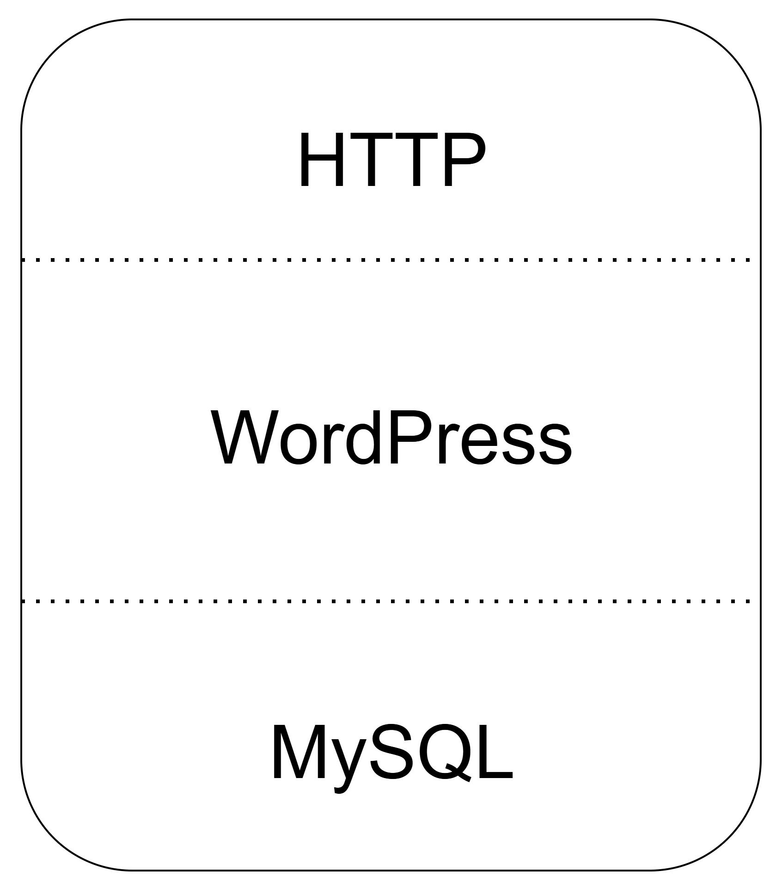

# WordPress 단일 서버 구축 가이드

> **작성자:** 백대홍  
> **작성일:** 2025-07-30  
> **버전:** 1.0  

# 목차

- [WordPress 단일 서버 구축 가이드](#wordpress-단일-서버-구축-가이드)
- [목차](#목차)
  - [1. 개요](#1-개요)
  - [](#)
  - [2. 필수 패키지 설치 및 서비스 시작](#2-필수-패키지-설치-및-서비스-시작)
    - [2.1 Apache(httpd) 설치](#21-apachehttpd-설치)
    - [2.2 Apache(httpd) 서비스 시작 및 부팅 시 자동 실행](#22-apachehttpd-서비스-시작-및-부팅-시-자동-실행)
    - [2.3 MySQL 서버 설치](#23-mysql-서버-설치)
    - [2.4 MySQL 서비스 시작 및 부팅 시 자동 실행](#24-mysql-서비스-시작-및-부팅-시-자동-실행)
    - [2.5 PHP 및 연동 모듈 설치](#25-php-및-연동-모듈-설치)
  - [3. 방화벽 설정](#3-방화벽-설정)
    - [3.1 HTTP 포트 및 MySQL 포트 허용](#31-http-포트-및-mysql-포트-허용)
  - [4. 워드프레스 다운로드 및 배치](#4-워드프레스-다운로드-및-배치)
    - [4.1 WordPress 다운로드](#41-wordpress-다운로드)
    - [4.2 압축 해제 및 배치](#42-압축-해제-및-배치)
    - [4.3 디렉토리 확인](#43-디렉토리-확인)
  - [5. WordPress 설정](#5-wordpress-설정)
    - [5.1 wp-config.php 설정 복사](#51-wp-configphp-설정-복사)
    - [5.2 wp-config.php 편집](#52-wp-configphp-편집)
  - [6. Apache 설정](#6-apache-설정)
    - [6.1 WordPress용 가상 호스트 설정 추가](#61-wordpress용-가상-호스트-설정-추가)
  - [7. MySQL 설정](#7-mysql-설정)
    - [7.1 MySQL 접속](#71-mysql-접속)
    - [7.2 데이터베이스 및 사용자 생성 (MySQL 내부)](#72-데이터베이스-및-사용자-생성-mysql-내부)
  - [8. SELinux 설정](#8-selinux-설정)
    - [8.1 DB 접속 허용 설정](#81-db-접속-허용-설정)
    - [8.2 확인 (선택)](#82-확인-선택)
  - [9. 설치 완료 및 접속 확인](#9-설치-완료-및-접속-확인)
    - [9.1 웹 브라우저 접속](#91-웹-브라우저-접속)
  - [10. 참고 사항](#10-참고-사항)


## 1. 개요

이 문서는 **웹 서버(Apache), PHP, MySQL, WordPress**를 단일 서버에 설치하는 방법을 설명합니다.  
학습용 또는 소규모 프로젝트용으로 적합한 **단일 노드 아키텍처**로, 관리가 쉽고 빠르게 구축할 수 있습니다.

---

---

## 2. 필수 패키지 설치 및 서비스 시작

### 2.1 Apache(httpd) 설치

```bash
sudo dnf install -y httpd
```

### 2.2 Apache(httpd) 서비스 시작 및 부팅 시 자동 실행

```bash
sudo systemctl start httpd
sudo systemctl enable httpd
```

### 2.3 MySQL 서버 설치

```bash
sudo dnf install -y mysql-server
```

### 2.4 MySQL 서비스 시작 및 부팅 시 자동 실행

```bash
sudo systemctl start mysqld
sudo systemctl enable mysqld
```

### 2.5 PHP 및 연동 모듈 설치

```bash
sudo dnf install -y php php-mysqlnd
```

---

## 3. 방화벽 설정

### 3.1 HTTP 포트 및 MySQL 포트 허용

```bash
sudo firewall-cmd --add-service=http --permanent
sudo firewall-cmd --add-port=80/tcp --permanent
sudo firewall-cmd --add-port=3306/tcp --permanent
sudo firewall-cmd --reload
```

---

## 4. 워드프레스 다운로드 및 배치

### 4.1 WordPress 다운로드

```bash
curl -o wordpress.tar.gz https://wordpress.org/latest.tar.gz
```

### 4.2 압축 해제 및 배치

```bash
tar xvf wordpress.tar.gz -C /var/www/html
```

### 4.3 디렉토리 확인

```bash
ls /var/www/html/
ls /var/www/html/wordpress/
```

---

## 5. WordPress 설정

### 5.1 wp-config.php 설정 복사

```bash
cp /var/www/html/wordpress/wp-config-sample.php /var/www/html/wordpress/wp-config.php
```

### 5.2 wp-config.php 편집

```bash
vi /var/www/html/wordpress/wp-config.php
```

아래 항목 수정:

```php
define( 'DB_NAME', 'wp' );
define( 'DB_USER', 'wp-user' );
define( 'DB_PASSWORD', 'password' );
define( 'DB_HOST', '192.168.56.44' ); 
// 단일 서버이므로 localhost로 적용
```

---

## 6. Apache 설정

### 6.1 WordPress용 가상 호스트 설정 추가

```bash
vi /etc/httpd/conf.d/wordpress.conf
```

```apache
<VirtualHost *:80>
    DocumentRoot /var/www/html/wordpress
    <Directory "/var/www/html/wordpress">
        AllowOverride All
    </Directory>
</VirtualHost>
```

---

## 7. MySQL 설정

### 7.1 MySQL 접속

```bash
mysql
```

### 7.2 데이터베이스 및 사용자 생성 (MySQL 내부)

```sql
CREATE DATABASE wp;

CREATE USER 'wp-user'@'192.168.56.44' IDENTIFIED BY '192.168.56.44';

GRANT ALL PRIVILEGES ON wp.* TO 'wp-user'@'192.168.56.44';

FLUSH PRIVILEGES;

EXIT;
```

## 8. SELinux 설정

### 8.1 DB 접속 허용 설정

```bash
setsebool -P httpd_can_network_connect_db 1
```

### 8.2 확인 (선택)

```bash
getsebool -a | grep httpd | grep db
```

---

## 9. 설치 완료 및 접속 확인

### 9.1 웹 브라우저 접속

```text
http://<서버 IP 주소>
```

성공적으로 접속이 되면 WordPress 설치 마법사가 시작되며, 관리자 계정과 사이트 정보 입력 후 설치를 완료할 수 있습니다.

---

## 10. 참고 사항

- OS: Rocky Linux 기준 (RHEL 계열)
- root 또는 sudo 권한 필요
- 해당 서버의 localhost는 192.168.56.44

